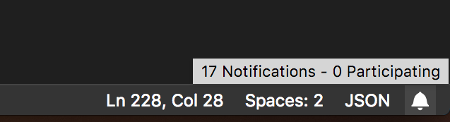

# GitHub Notifications

<p align="center">
  
</p>

A secure, customizable, statusbar icon that notifies you about notifications on GitHub.

You can customize it to your likings, choose when to show it and which icon/color/browser to use.

## Install

Follow the instructions in the [Marketplace](https://marketplace.visualstudio.com/items?itemName=fabiospampinato.vscode-github-notifications-bell), or run the following in the command palette:

```shell
ext install fabiospampinato.vscode-github-notifications-bell
```

## Usage

It adds 2 commands to the command palette:

```js
'GitHub Notifications: Refresh' // Refresh the notifications
'GitHub Notifications: Open in Browser' // Open the notifications page in the browser
```

## Settings

This extension requires you to provide an OAuth token, to create it go [here](https://github.com/settings/tokens), click "Generate new token" and be sure to select the "notifications" scope, then click "Generate token".

```js
{
  "githubNotificationsBell.refreshInterval": 300, // Amount of seconds to wait before each refresh
  "githubNotificationsBell.oauthToken": "", // OAuth token used for requesting the notifications
  "githubNotificationsBell.alignment": "right", // Bell's position in the statusbar (left/right)
  "githubNotificationsBell.icon": "mark-github", // The icon to use in the statusbar
  "githubNotificationsBell.color": "", // Bell's color when there are some notifications
  "githubNotificationsBell.hideIfNone": true, // Hide the bell if there are no notifications
  "githubNotificationsBell.showNumberOfNotifications": true // Show the number of notifications alongside the bell icon
}
```

## Demo



## Hints

- **Icon**: [Here](https://octicons.github.com/) you can browse a list of supported icons. If for instance you click the first icon, you'll get a page with `.octicon-alert` written in it, to get the string to use simply remove the `.octicon-` part, so in this case the icon name would be `alert`.

## Contributing

If you found a problem, or have a feature request, please open an [issue](https://github.com/fabiospampinato/vscode-github-notifications-bell/issues) about it.

If you want to make a pull request you can debug the extension using [Debug Launcher](https://marketplace.visualstudio.com/items?itemName=fabiospampinato.vscode-debug-launcher).

## License

MIT © Fabio Spampinato
